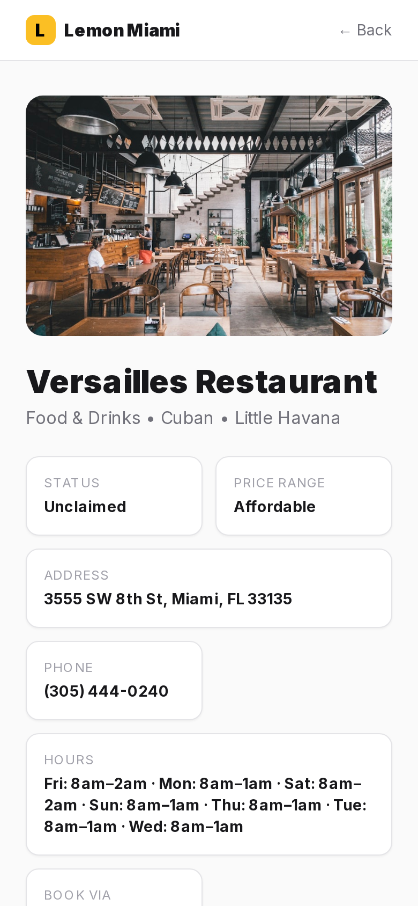
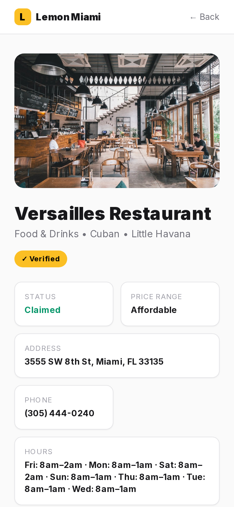

# Lemon for Business

Vendor acquisition MVP for Lemon — a Miami local services marketplace. Business owners search for their listing, claim it through a guided 6-screen flow, and submit for verification. Built to demonstrate end-to-end product thinking: landing page → search → claim → auth → verify → checkout.

**Live site:** https://lemon-business-mvp.vercel.app

---

## What's built

### Landing page (`/`)
Full marketing page targeting Miami business owners. Sections: hero with live business counter + search, category pills, 3 value props, social proof card, mid-page search, how it works (3 steps), "This isn't another directory" dark section with phone mockup, amber CTA, FAQ accordion, third search placement, footer. Sticky nav bar appears on scroll past the hero.

### Claim flow (`/claim/[id]/*`)
6-screen guided funnel:

| Screen | Route | Description |
|--------|-------|-------------|
| 1 | `/claim/[id]` | Profile preview — fake view count, Lemon Score, reactions. Shows the owner what customers see. |
| 2 | `/claim/[id]/edit` | Edit profile — 10 sections (name, category, photos, hours, address, price range, about us, good-to-know chips, booking options). Auto-saves draft to DB every 2s. Booking nudge if owner selects anything other than Lemon. |
| 3 | `/claim/[id]/account` | Account creation — email/password via Supabase Auth. Google/Apple buttons (UI only for MVP). |
| 4 | `/claim/[id]/verify` | Ownership verification — Google Business, phone, or document upload (PDF/JPG to Supabase Storage). Writes a `verification_records` row with `status=pending`. |
| 5 | `/claim/[id]/value` | Value props — 3× booking stat, 6 feature cards, pricing. |
| 6 | `/claim/[id]/checkout` | Plan selection (Starter $49/mo, Growth $99/mo). Fake Stripe UI, card fields greyed out until trial ends. "Start free trial" shows success state. |

### Admin panel (`/admin`)
Magic-link login at `/login`. Dashboard lists all pending claim requests with approve/reject actions. Approving a claim sets `is_verified = true` on the business. Protected by session check against `ADMIN_EMAIL` env var.

### Business profile (`/business/[id]`)
Public-facing listing page: photo, name, category, hours, address, phone, price range, about us, good-to-know tags, booking option. Claim CTA shown only if business is not yet verified.

### Dashboard (`/dashboard`)
Post-claim owner dashboard. Shows verification status, business summary, and a link back to the edit profile flow. Redirects to `/login` if unauthenticated.

---

## Tech stack

- **Framework:** Next.js 14 (App Router, server + client components)
- **Database + Auth:** Supabase (Postgres, Row Level Security, Magic Link + password auth)
- **Storage:** Supabase Storage (`documents` bucket for verification uploads)
- **Styling:** Tailwind CSS (light theme: white/zinc palette, amber-400 accent)
- **Email:** Resend (`onboarding@resend.dev` — delivers only to verified Resend account email without a custom domain)
- **Deployment:** Vercel (auto-deploy on push to `master`)

---

## Database schema

Key tables (Supabase Postgres):

```sql
-- Core listing table
businesses (
  id            UUID PRIMARY KEY,
  name          TEXT,
  category      TEXT,           -- matches enum: Food & Drinks, Beauty, Fitness & Wellness, etc.
  subcategory   TEXT,
  neighborhood  TEXT NOT NULL,
  address       TEXT,
  phone_number  TEXT,
  photo_urls    TEXT[],
  hours         JSONB,          -- { Mon: "9am–6pm", ... }
  price_range   TEXT,
  booking_option booking_type,  -- enum: Lemon | Call | Walk-in | External
  about_us      TEXT,
  good_to_know  TEXT[],
  draft_data    JSONB,          -- pending edits from claim flow Screen 2
  draft_updated_at TIMESTAMPTZ,
  is_verified   BOOLEAN DEFAULT false,
  created_at    TIMESTAMPTZ
)

-- Claim requests (legacy flow)
claim_requests (
  id, business_id, owner_email, owner_full_name, status, created_at
)

-- Verification submissions from Screen 4
verification_records (
  id           UUID PRIMARY KEY,
  business_id  UUID REFERENCES businesses(id),
  user_id      UUID REFERENCES auth.users(id),
  method       TEXT CHECK (method IN ('google', 'document', 'phone')),
  status       TEXT DEFAULT 'pending' CHECK (status IN ('pending', 'approved', 'rejected')),
  document_url TEXT,
  created_at   TIMESTAMPTZ
)
```

Migration file: `supabase/migrations/001_draft_and_verification.sql`

---

## Local setup

```bash
git clone https://github.com/CapinCrack/lemon-business-mvp.git
cd lemon-business-mvp
npm install
```

Create `.env.local`:

```
NEXT_PUBLIC_SUPABASE_URL=your_supabase_project_url
NEXT_PUBLIC_SUPABASE_ANON_KEY=your_supabase_anon_key
SUPABASE_SERVICE_ROLE_KEY=your_supabase_service_role_key
NEXT_PUBLIC_SITE_URL=http://localhost:3000
ADMIN_EMAIL=your_email@example.com
RESEND_API_KEY=your_resend_api_key
EMAIL_FROM=onboarding@resend.dev
```

Run the migration in your Supabase dashboard SQL editor (paste contents of `supabase/migrations/001_draft_and_verification.sql`).

Create a `documents` bucket in Supabase Storage (private, 10MB file size limit).

```bash
npm run dev
```

---

## Deployment

Auto-deploys to Vercel on every push to `master`. Set the same env vars above in your Vercel project settings (Settings → Environment Variables).

Supabase configuration required:
- **Site URL:** your Vercel deployment URL
- **Redirect URLs:** `https://your-app.vercel.app/auth/callback`
- **Email templates:** magic link redirect should point to your Vercel URL (not localhost)

---

## API routes

| Method | Route | Description |
|--------|-------|-------------|
| `GET` | `/api/businesses` | Search businesses by name (query param `q`) |
| `POST` | `/api/businesses/draft` | Auto-save draft edits from Screen 2 |
| `POST` | `/api/businesses/verify` | Submit verification method + optional document upload |
| `POST` | `/api/claims` | Submit a claim request (legacy flow) |
| `POST` | `/api/claims/resolve` | Approve/reject a claim (admin) |
| `POST` | `/api/admin/claims/resolve` | Approve/reject with email notification (admin, session-protected) |
| `POST` | `/api/auth/magic-link` | Send magic link email for admin login |
| `GET` | `/auth/callback` | Supabase auth redirect handler |

---

## Seed data

9 Miami businesses pre-loaded, one per category:

| Business | Category |
|----------|----------|
| Biscayne Bay Boat Tours | Activities & Experiences |
| South Beach Auto Care | Auto |
| South Beach Sol Tanning | Beauty |
| Wynwood Social Events | Events |
| Brickell Gym Collective | Fitness & Wellness |
| Versailles Restaurant | Food & Drinks |
| Magic City Plumbing | Home Improvement |
| Brickell Pet Spa | Pets |
| Miami Express Dry Cleaning | Time Savers |

---

## Known limitations (MVP scope)

- Google and Apple OAuth on Screen 3 are UI-only — clicking them does nothing
- Checkout on Screen 6 is fake — no Stripe integration, "Start free trial" shows a success state
- Email delivery via `onboarding@resend.dev` only reaches the Resend account holder's inbox. A verified custom domain is required for real delivery to business owners
- Admin verification review is manual — no automated approval workflow
- Dashboard stats (views, bookings, reviews) are placeholders

---

## Writeup

### What I built vs. what I cut, and why

Built everything in the core funnel: landing page with real search, all 6 claim flow screens, Supabase auth, document upload to Storage, admin panel with approve/reject, and an owner dashboard. The saved-but-unpublished flow works end-to-end - edits in Screen 2 auto-save to `draft_data`, and on admin approval those fields are merged into the live business record.

Cut or left as stubs:
- **Stripe** - wiring real payments into an MVP with no real customers is premature. The fake checkout demonstrates the UX decision (free trial gate) without any compliance overhead.
- **Google/Apple OAuth** - Supabase supports it, but it requires app store review and OAuth consent screen approval which has multi-day lead times. Email/password gets you 95% of the way for an MVP.
- **Real dashboard stats** - views, bookings, and reviews require instrumentation infrastructure (event tracking, aggregation jobs). Placeholders communicate the intent; building the pipeline would be a week of work with no user-facing payoff yet.
- **Automated verification** - manual admin review is actually the right call at seed stage. You want a human in the loop while you figure out what fraud looks like.

### Schema decisions and trade-offs

The key decision was the `draft_data` JSONB column on `businesses`. The alternative was a separate `business_drafts` table with foreign key to `businesses`. I chose the JSONB approach because:
1. It collapses the saved/published distinction into a single row - no join needed when rendering the edit screen
2. Auto-save writes are a single `UPDATE businesses SET draft_data = $1` - simple, cheap, no orphaned draft rows
3. The trade-off is you lose per-field change history and can't diff individual fields between draft and live. That's fine for an MVP where the admin is just doing spot-check approval, not granular field review

`verification_records` is a separate table (not a column on `businesses`) because a business can have multiple verification attempts across different methods, and the admin needs to see the full history.

The `owner_id` column on `businesses` ties the claimed listing to a Supabase auth user, which is what protects the dashboard and edit flow. RLS policies enforce that only the owner can read their own draft.

### Spec ambiguities and the calls I made

**"Saved-but-unpublished state"** - the spec didn't define exactly when draft edits go live. Below are screenshots of the same business in both states:

| State A — Draft saved, pending approval | State B — Approved, live listing |
|---|---|
|  |  |

State A: the owner has edited their profile in Screen 2 (edits persisted in `draft_data`), but the public `/business/[id]` page still shows the original seeded data. State B: after admin approval the `draft_data` fields are merged into the main columns and the public listing reflects the owner's edits.

**"Saved-but-unpublished state"** - the spec didn't define exactly when draft edits go live. I interpreted this as: edits save immediately to `draft_data` (autosave), but the public listing only shows the merged fields after admin approval. This means an owner can see their draft in the claim flow preview but customers see the original data until verified. That's the safer product call - you don't want unverified edits showing on a public listing.

**Verification methods** - the spec listed "Google Business, phone, or document." Phone verification typically means SMS OTP which needs Twilio and a sending number. I made phone a self-attestation (checkbox + phone number entry) rather than an actual OTP flow. Honest about this in the UI.

**The value screen (Screen 5)** - spec implied it was a simple pricing screen. I added the 3x booking stat and feature card grid because a plain pricing table with no context doesn't convert. The stat is placeholder but the layout communicates the intended sales motion.

### What I'd change with another week

1. **Real Stripe** - subscriptions via Stripe Checkout, webhook to set `plan` on the business record, and gate the dashboard features behind plan tier
2. **Custom email domain** - verify a domain in Resend so outbound email actually reaches claimants
3. **Search quality** - current search is `ilike '%query%'` on name only. I'd add full-text search across name + category + neighborhood, and weight results by `is_verified`
4. **RLS audit** - the draft API route uses the service role key to bypass RLS. That's a shortcut that should become a properly scoped RLS policy so the service key isn't needed client-side
5. **Photo upload in edit flow** - the photo field in Screen 2 accepts URLs but doesn't have a file picker. Real upload to Supabase Storage with a presigned URL would close this gap

### What's broken and what I'd fix first

**Most important:** The draft→live merge on admin approval was only wiring `is_verified=true` and not merging `draft_data` fields into the main columns. Fixed in this commit. Without it, any edits made in Screen 2 were silently discarded on approval.

**Second:** Email only reaches the Resend account holder. Any claimant with a different email address gets no confirmation or decision notification. Fix: verify a custom domain in Resend.

**Third:** The dashboard `owner_id` query assumes one business per user. If a user somehow ends up linked to multiple businesses (e.g., via the legacy `claim_requests` path), it silently returns only the first. Should either enforce the constraint at the DB level or handle the multi-business case in the UI.
